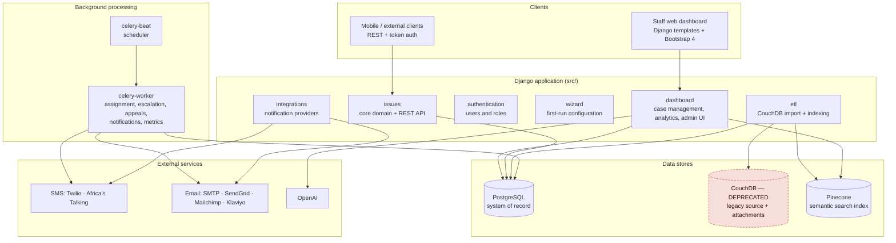

# GRM Benin — Architecture, Users and Features

Technical overview of the **Grievance Redress Mechanism (GRM)** web application for Benin (COSO / MGP). It describes how the system is put together, who uses it, and what it does.

This document reflects **what the code currently does**, not what is planned. Where behaviour is surprising or a feature is configured but inert, it is flagged as such.

---

## 1. What the system is

A case-management platform for citizen grievances. Citizens (usually through a facilitator or village secretary) report an issue; the system assigns it to the right government official based on the issue's category and location; officials work it through a configurable set of statuses; and the system escalates cases that sit too long, routes appeals, notifies citizens, and reports on performance.

Everything about the taxonomy — administrative levels, departments, issue types, statuses, citizen groups — is **configured per deployment** through a first-run wizard, not hardcoded. That is what makes the same codebase reusable for another country.

---

## 2. Architecture at a glance

### Tech stack

| Layer | Technology |
|---|---|
| Framework | Django 4.2 (Python 3.10 per README) |
| API | Django REST Framework + token auth; Swagger via `drf_yasg` (**DEBUG only**) |
| UI | Django templates + Bootstrap 4, server-rendered |
| Primary database | PostgreSQL (`DATABASE_URL`) |
| Secondary store | ⚠️ CouchDB — **deprecated**; legacy-migration source + file attachments. Not needed for a fresh deployment (see §3) |
| Vector search | Pinecone |
| Background jobs | Celery + Celery Beat, `django_celery_beat` / `django_celery_results` |
| i18n | Django i18n with a custom locale middleware (`grm/middleware/locale.py`) |
| Deployment | Vercel (web) + separate Celery containers (`docker-compose.celery.yml`) |

---

## 3. Data stores — and why there are three

**PostgreSQL is the system of record.** All the models described below live here.

### ⚠️ CouchDB — DEPRECATED

> **CouchDB is deprecated. Do not build new features on it.** Anything new should read from and write to PostgreSQL. Existing CouchDB code paths are retained only for backward compatibility and are expected to be removed.

CouchDB is only relevant when there is an **earlier deployment to migrate data from**.

**A from-scratch deployment does not need a CouchDB server at all.** A clean install seeds PostgreSQL directly — `manage.py migrate && manage.py set_benin_demo`, which is exactly the Vercel `buildCommand`, and which contains no CouchDB code — and the CouchDB client connects **lazily** (`client.get_db()` opens a connection only when called), so nothing contacts it at boot.

> ⚠️ **One catch, and it is configuration rather than data.** [settings.py](../src/grm/settings.py) reads the seven `COUCHDB_*` variables with `env(...)` and **no defaults**, so Django refuses to start if they are undefined — even on a clean install that never uses them. Placeholder values are enough to boot. Removing that requirement is the natural first step of the migration.

What still depends on it, in a deployment that carries legacy data:

| Dependency | Where | Notes |
|---|---|---|
| Data import into Postgres | `etl/management/commands/etl_fetch_*.py`, via [client.py](../src/client.py) | Pulls issues, administrative regions and ADL data from an existing CouchDB |
| **File attachments** | `client.upload_file` | Attachments are uploaded to CouchDB, not to Postgres or object storage |
| Document back-references | `User.external_id`, `Issue.external_id` | Hold the corresponding CouchDB document `_id` |
| Legacy seeding path | `couchdb/jsonCollections/` | Older route for reference data; the wizard and `set_benin_demo` seed Postgres directly instead |

**Migrating away** means: making the `COUCHDB_*` settings optional, re-homing attachments to object storage, retiring the ETL import once the legacy data is in, and dropping the `external_id` coupling.

**Pinecone** holds vector embeddings of issue text, populated by `etl_upload_issues_to_pinecone` and queried by the semantic search feature. `Issue.vectorized` tracks whether a given issue has been indexed.

---

## 4. Modules

Django apps under `src/` (`CREATED_APPS` in [grm/settings.py](../src/grm/settings.py)):

| App | Responsibility |
|---|---|
| **`issues`** | The core domain: `Issue` and its whole taxonomy, plus the public REST API |
| **`authentication`** | Custom `User` model and the three role profiles |
| **`dashboard`** | The staff web UI — case management, analytics, user admin, search, settings |
| **`wizard`** | First-run configuration; blocks the app until completed |
| **`etl`** | Imports from CouchDB (⚠️ deprecated source), indexes into Pinecone, logs each run |
| **`integrations`** | Pluggable SMS/email providers, templates, rules, webhooks |
| **`common`** | Shared utilities (`openai_connector`, `pinecone_connector`) |

`dashboard` is itself split into sub-apps, routed in [dashboard/urls.py](../src/dashboard/urls.py):

`authentication` (login, error handlers) · `diagnostics` (home + issue statistics) · `grm` (**case management — the main working surface**) · `search` (semantic search) · `user_management` (staff CRUD) · `performance_diagnostics` (KPIs, AI insight, bulk notifications) · `settings` · `adls` · `subprojects` (**currently disabled** — commented out in the URL config).

---

## 5. Users and roles

Authentication is by **email** (`AUTH_USER_MODEL = authentication.User`). Roles are not Django groups — they are a mix of **boolean flags on `User`** and **one-to-one profile models**.

### Role model

| Role | How it's represented | What identifies them |
|---|---|---|
| **GRM Manager** | `User.grm_manager = True` | Sees **all** confirmed issues, system-wide |
| **GRM Owner** | `User.grm_owner = True` | Ownership flag on the user record |
| **Government worker** (case manager / PIU staff) | `GovernmentWorker` profile | A **department** + an **administrative region**; sees issues where they are PIU staff |
| **Facilitator / Village secretary** | `Facilitator` profile | An administrative region, plus `unique_region` and `village_secretary` flags. Reports issues on a citizen's behalf |
| **Citizen** | `Citizen` profile | Links a `User` to an `issues.Citizen` record |
| **Django admin** | `is_staff` / `is_superuser` | Django admin at `/admin/` |

`User` also carries `phone_number`, `photo`, `external_id` (CouchDB doc id) and `last_activity` — the last of which feeds the inactive-user reporting in performance diagnostics.

### Who can see an issue

The read rule lives in [dashboard/grm/permissions.py](../src/dashboard/grm/permissions.py) and is deliberately narrow:

- **Unconfirmed issue** (`confirmed = False`) → **only the reporter**. A draft is private until submitted.
- **Confirmed issue** → a **GRM Manager** sees everything; a **government worker** sees it only if `issue.is_piu_staff(user)`.

The REST API layers its own check on top: `IsReporterOrAssigneePermission` ([issues/permissions.py](../src/issues/permissions.py)) restricts issue updates to the issue's reporter or its current assignee, and individual fields are further restricted inside `IssueUpdateSerializer` (for example, only the **assignee** may raise an appeal; only the **reporter** may set a rating).

---

## 6. The domain model

Core entities in [issues/models.py](../src/issues/models.py):

**`Issue`** — the central record. Beyond the obvious (description, dates, citizen, reporter, assignee) it carries:

- `tracking_code` / `internal_code` — the citizen-facing reference
- `confirmed` — draft vs. submitted
- `status` → `IssueStatus`
- `escalate_flag`, `escalated_date`, `escalation_reason` — escalation state
- `appeal_status`, `appeal_reason` — appeal state
- `reject_flag`, `reject_reason`, `research_result` — resolution work
- `rating` (1–5, set by the reporter), `vectorized`, `alert_message_status`
- `contact_medium` / `contact_method` — including **anonymous reporting**

**`IssueStatus`** — statuses are data, not code. Each carries semantic flags (`initial_status`, `open_status`, `final_status`, `rejected_status`) plus two independent SLA numbers: `threshold_days` (performance colouring) and `threshold_days_to_escalate` (drives auto-escalation).

**`IssueStatusChange`** — an audit row per (issue, status) interval with `entered_at` / `exited_at`. This is what lets the system compute "days in current status".

**`AdministrativeLevel` / `AdministrativeRegion`** — a self-referential tree (e.g. Country → Département → Commune) with exactly one root, a cached `hierarchical_name`, and recursive-CTE helpers for ancestors and descendants.

**`IssueCategory`** — the routing table. Each category points at an `assigned_department` (normal flow) and an `assigned_appeal_department` (appeals). It also has `assigned_escalation_department`, which is **configured in the wizard but never read by the escalation code** — the model itself carries a `# TODO: Remove this field`.

Supporting taxonomy: `IssueType` / `IssueSubType`, `IssueDepartment` (+ its administrative-level mapping), `Component` / `SubComponent` / `SubProjectGroup`, `Citizen`, `CitizenAgeGroup`, `CitizenGroup`, `Comment`, `IssueAttachment`.

---

## 7. Features

### 7.1 Issue intake and case management

The staff working surface is `dashboard/grm` ([urls.py](../src/dashboard/grm/urls.py)):

- **Six-step guided intake** (`new_issue_step_1` … `step_6`) — contact, person, details, location, confirm, confirmation
- **Issue list, detail and edit**, with cascading administrative-region selectors
- **Review queue** (`review_issues`) for unconfirmed submissions
- **Status workflow actions**: open a case, record a research result, record a rejection reason
- **Comments and attachments** (upload / delete)
- **Escalate / de-escalate** buttons, and a gated view for **sensitive issue data**

### 7.2 Assignment, escalation and appeals

Handled by scheduled jobs in [grm/tasks.py](../src/grm/tasks.py):

- **Automatic backfill and assignment** — `check_issues` sweeps confirmed issues and fills in three things: the **internal code**, the **anonymisation** of citizen data where required, and the **assignee**. Assignment (`Issue.get_assignee`) applies only when the category has a `redirection_protocol`: a village secretary in the issue's region gets it first, and otherwise it goes to the **least-loaded** government worker of the category's department in that region.
- **Automatic escalation** — a daily job flags issues whose days-in-status exceed `threshold_days_to_escalate`; a job every 5 minutes then reassigns each flagged issue **one administrative level up**, within the same department, climbing until it finds an official or reaches the root.
- **Manual escalation / de-escalation** — from the dashboard, for GRM Managers and PIU staff. De-escalation exists **only** manually.
- **Appeals** — an hourly job reassigns appealed issues to the head of the category's `assigned_appeal_department`. This is a **jump to a fixed department**, not a climb up the hierarchy.

> Full detail, including the fact that there is **no cap on appeals** and that citizens are **never notified of an escalation**, is in [sistema-apelacion-escalado.md](sistema-apelacion-escalado.md).

### 7.3 Notifications

Two layers coexist:

- **Built-in**: `grm/notifications.py` with the types in `grm/constants.py` — `created`, `status_changed`, `appealed`, `assigned`. Delivered by SMS or email depending on the citizen's `contact_method`, drained by `send_sms_message` / `send_mail_message` every 5 minutes.
- **The `integrations` app**: a fuller, configurable system — `NotificationProvider`, `Integration`, `NotificationTemplate`, `NotificationRule`, `NotificationLog`, `WebhookEndpoint` — with provider adapters for **Twilio**, **Africa's Talking**, **SendGrid**, **Mailchimp** and **Klaviyo**, each bootstrapped by its own `init_*` management command.

### 7.4 Analytics and AI

- **Diagnostics** — home dashboard and issue statistics.
- **Performance diagnostics** — KPI metrics, regional performance, status bottlenecks, inactive-user detection and **bulk notifications**, backed by precomputed metric tables (`dashboard/models.py`) that Celery refreshes on a sharded schedule.
- **AI insight** (`api_ai_insight`) — narrative interpretation of the metrics via OpenAI.
- **Semantic search** (`dashboard/search`) — natural-language search over grievances using Pinecone embeddings, with graceful degradation when Pinecone is not configured.

### 7.5 First-run configuration wizard

`wizard` gates the entire application. Two middlewares (`WizardRedirectMiddleware`, `DisableWizardCacheMiddleware`) redirect all traffic until the wizard is finished — a fresh install shows *"Login is not allowed until the customization wizard is completed."*

Ten sections must be completed: **project · administrative levels · administrative regions · departments · issue types · categories · issue statuses · citizen age groups · citizen groups · components**.

### 7.6 REST API

Under `/issues/` ([issues/urls.py](../src/issues/urls.py)), token-authenticated, for mobile and external clients:

- **Issues**: create, retrieve, update (`PATCH`), list by assignee, list by reporter
- **Comments** and **attachments**: list, add, delete
- **Reference data**: statuses, types, sub-types, categories, components, sub-components, subproject groups, citizen age groups, citizen groups
- **Geography**: region list and region children (for cascading selectors)

Swagger UI is served at `/swagger/` **only when `DEBUG` is on**.

---

## 8. Background jobs

Registered in `setup_periodic_tasks` ([grm/tasks.py](../src/grm/tasks.py)):

| Job | Frequency | Purpose |
|---|---|---|
| `check_issues` | 5 min | Assign newly confirmed issues |
| `escalate_issues` | 5 min | Execute pending escalations |
| `send_sms_message` | 5 min | Drain the SMS queue |
| `send_mail_message` | 5 min | Drain the email queue |
| `mark_issues_to_be_escalated` | daily | Flag issues past their escalation threshold |
| `reassign_issues_to_appeal` | hourly | Route appealed issues to the appeal department |
| Performance-metric refresh | 15 min, sharded | Recompute KPI tables per region |

> ⚠️ **Deployment caveat.** The web app runs on **Vercel**, which cannot host long-running processes. `vercel.json` wires up exactly **one** cron — `_cron/check-issues` ([grm/cron_views.py](../src/grm/cron_views.py)). Everything else in the table above runs **only** if the separate Celery worker/beat containers from `docker-compose.celery.yml` are deployed and running. If they are not, automatic escalation, appeal routing, queued notifications and metric refreshes silently do not happen, even though the code is present and correct.

---

## 9. Running it

See the [README](../README.md) for the full setup. In short: PostgreSQL, `grm/.env` and `grm/local_settings.py` from their templates, then `manage.py migrate` and `manage.py runserver`.

You only need a **running CouchDB** if you are importing data from an earlier deployment (see §3) — a fresh install does not. The `COUCHDB_*` variables must nevertheless be present in `.env` for Django to start, even if they point nowhere. The Celery side is `docker compose -f docker-compose.celery.yml up -d --build` with a repo-root `.env.celery`.

Internationalisation matters here: the app ships `locale/` translations and management commands extend `TranslatedBaseCommand`, with `CMD_LANGUAGE_CODE` in `local_settings.py` selecting the language used by command output.

---

## 10. Reusing this for another country

The README documents this path, and the architecture supports it:

1. Run the **wizard** to define administrative levels, regions, departments, categories, statuses and groups.
2. ⚠️ The README also describes seeding the CouchDB JSON collections in `couchdb/jsonCollections/`. That is the **legacy route** and is not required for a new deployment — the wizard plus a seed command (`set_benin_demo` is the worked example) populate PostgreSQL directly. See §3.
3. Adapt the intake views and their templates in `dashboard/grm/views.py` (`NewIssueContactFormView`, `NewIssuePersonFormView`, `NewIssueDetailsFormView`, `NewIssueLocationFormView`, `NewIssueConfirmFormView`) to the local intake form.

`issues/management/commands/set_benin_demo.py` is a worked example: it builds the full Benin hierarchy (country → 12 départements → 77 communes) with demo users and issues.

---

## 11. Where to look

| To understand… | Read |
|---|---|
| The domain | [issues/models.py](../src/issues/models.py) |
| Roles and profiles | [authentication/models.py](../src/authentication/models.py) |
| Who can see what | [dashboard/grm/permissions.py](../src/dashboard/grm/permissions.py), [issues/permissions.py](../src/issues/permissions.py) |
| Case management UI | [dashboard/grm/views.py](../src/dashboard/grm/views.py) |
| Scheduled behaviour | [grm/tasks.py](../src/grm/tasks.py) |
| Appeals and escalation in depth | [sistema-apelacion-escalado.md](sistema-apelacion-escalado.md) |
| Configuration surface | [wizard/forms.py](../src/wizard/forms.py), [grm/settings.py](../src/grm/settings.py) |
