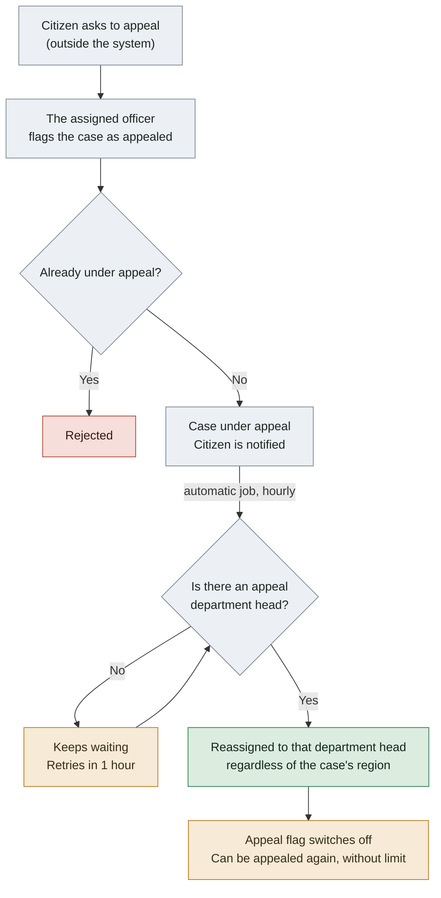
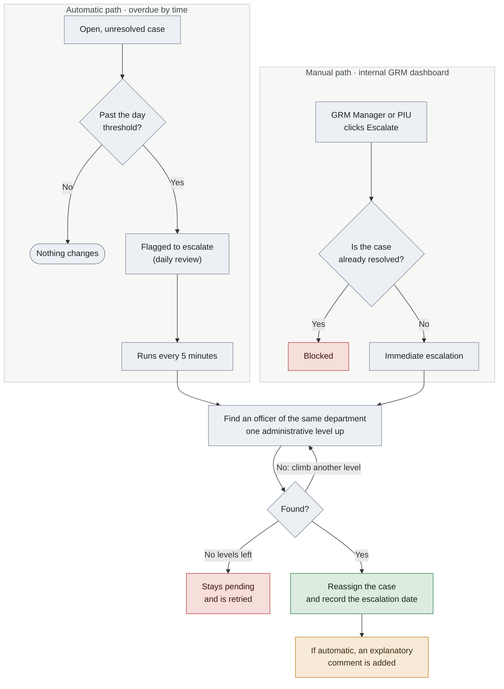

# How Appeals and Escalation Work Today

This document describes the **current behaviour of the code** — not the intended or planned design — for two GRM mechanisms: appealing a case, and escalating it (manually and automatically) across administrative levels.

---

## 1. The Appeal System

**What is it?** A yes/no flag that marks a case as "under appeal" and reassigns it to a fixed department responsible for reviewing appeals.

**Who can appeal a case?**
Only the person currently **assigned** to the case (the case manager handling it) can raise an appeal, through the case-update API. **There is no appeal button for the citizen**, neither in the app nor in the internal GRM dashboard. In practice, if a citizen wants to appeal, they have to ask the assigned officer (by phone, in person, and so on) to set the flag on their behalf.

**How is it raised?**
- The appeal flag can only go from "No" to "Yes". It cannot be cleared manually, and a case already marked as appealed cannot be appealed again while that appeal is pending.
- Nothing requires the case to be "resolved" or "closed" before appealing — technically it can be flagged in any status.
- Raising it automatically sends a notification to the citizen (email or SMS, depending on their contact method).

**What happens next?**
An automatic job runs **every hour**, picks up every case flagged as under appeal, and reassigns it to the **head of the appeal department configured for that issue category** (configured once per category, in the setup wizard). Three things are worth noting:

- This reassignment **does not follow the administrative hierarchy** (country → department → commune). It jumps straight to a fixed department, regardless of the case's territorial level.
- The place where the issue occurred (its location/region) **never changes** — only the person responsible for handling it does.
- Once reassigned, the appeal flag switches itself off (back to "No"), leaving the case free to be appealed again later.
- If the case's category has no appeal-department head configured, the case simply waits and is retried every hour.

**How many times can a case be appealed? Is there a limit?**
**There is no limit and no appeal counter in the current system.** No field records how many times a case has been appealed, and there is no maximum. The only rule is that a case cannot be appealed again while an appeal is still pending (the flag can only go No→Yes) — but since the flag resets itself after each reassignment, a case could in principle be appealed repeatedly without restriction.

### 1.1 Appeal flow diagram

**How to read it:** the only person who can start the cycle is the assigned officer, not the citizen. Once the appeal is raised, everything else happens on its own at the next hourly pass — and if no appeal department head is configured for that category, the case loops on the same step until someone configures one.

---

## 2. The Escalation System

**What is it?** The process by which a case is reassigned to an officer at a **higher administrative level** (or a lower one, when de-escalated), within the same thematic department (Health, Education, and so on), when it is not being resolved in time.

There are two ways to escalate: **automatic** and **manual**. Both use the same underlying mechanism — walking up or down the tree of administrative regions to find the right officer — but they are triggered differently.

### 2.1 Automatic escalation

Two scheduled background jobs do the work:

1. **Flagging (once a day):** reviews every open case (not in a final or rejected status) and computes how many days it has spent in its current status. If that exceeds the "days to escalate" threshold configured for that status (set per status in the setup wizard), the case is flagged as ready to escalate.

2. **Execution (every 5 minutes):** takes every flagged case and looks for an officer at the **next administrative level up**, within the same department. If it finds one, it reassigns the case, records the escalation date, and leaves an automatic comment explaining that the case was escalated for exceeding its processing time. If nobody is found at that level, it keeps climbing level by level up to the root (country level); if still nobody is found, the case stays pending and is retried on the next run.

**Important:** as with appeals, the case's original location never changes — only who is responsible for it. And **the citizen receives no notification when their case is escalated**, whether automatically or manually.

### 2.2 Manual escalation

A GRM Manager or authorised PIU staff member can escalate or de-escalate a case by hand from the internal dashboard, with a button for each action:

- **Escalate:** finds the officer at the next level up (same department) and reassigns the case. Blocked if the case is already in a final/resolved status.
- **De-escalate:** the reverse — finds an officer at a lower level in the region tree and reassigns the case downwards.

**Note:** de-escalation exists **only** as a manual action. No automatic process ever moves a case back down a level.

### 2.3 Escalation flow diagram

**How to read it:** there are two entry points into the same machinery — the clock (automatic) or a human click (manual) — but both end at the same step: finding, within the same thematic department, the officer one administrative level up. The only visible difference after reassignment is that automatic escalation leaves a comment explaining why it happened, while manual escalation leaves none. De-escalation follows the same logic in the opposite direction and exists only on the manual path.

### 2.4 Appeals vs. Escalation, side by side

| | Appeal | Escalation |
|---|---|---|
| Who triggers it | Only the officer assigned to the case | The clock (automatic) or a GRM Manager / PIU (manual) |
| Where it reassigns to | A fixed department, configured per issue category | The next administrative level (up or down), same department |
| Does it follow the territory? | No — jumps straight to a fixed point | Yes — one level at a time |
| Is there a limit? | No counter, no cap | No cap on the number of times, but it runs out at the top level (country) |
| Is the citizen notified? | Yes, when it is raised | No, in neither case |
| What audit trail is left? | Only the current state (yes/no) and a free-text reason | Only the date of the last escalation, plus a comment if it was automatic |

---

## 3. Administrative levels and how a case moves between them

Administrative regions are organised as a tree — for Benin, **Country → Departments → Communes** — with a single root level (the country).

When a case moves "up" or "down" a level through escalation, what actually changes is **who the responsible officer is**, not where the case is. The system looks, within the same thematic department (Health, say), for the officer assigned to the parent administrative level (to move up) or to a child level (to move down) of the region where the current handler sits.

The real location where the problem occurred — the case's region — is set once, when the case is created, and is **never modified** by an appeal or an escalation. It is a fixed historical fact about the case.

---

## 4. Things to be aware of

- **Appeals depend on the assigned officer, not the citizen.** If the expectation is that citizens can appeal directly, that capability does not exist in the system today.
- **There is no appeal limit.** If a cap is needed (for example "at most 2 appeals per case", or "appeals only go up to country level"), it has to be built — it does not exist today.
- **The automatic jobs (escalation and appeal reassignment) depend on a background process (Celery) that must run separately from the website.** If that process is not running in a given environment, automatic escalation and appeal reassignment simply do not happen, even though the code is there.
- **The citizen is never notified when their case is escalated** — only when it is created, changes status, is assigned, or is appealed.
