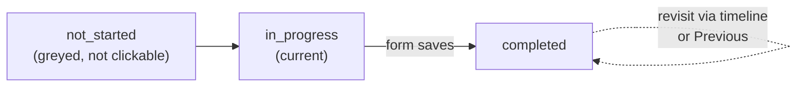
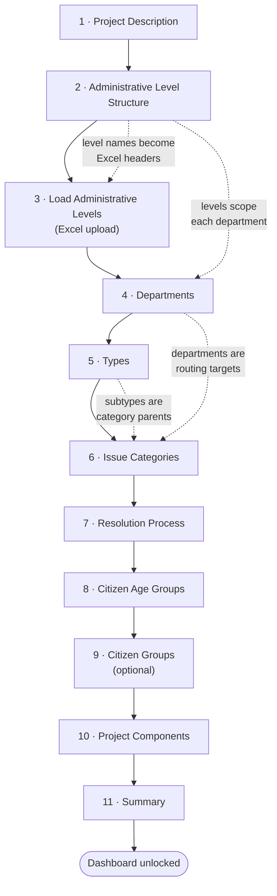

# GRM Configuration Wizard — Guide

How the first-run configuration wizard works: what it gates, how a step is defined and advanced, and what each of the eleven sections asks for and writes to the database.

This document reflects **what the code currently does**. Behaviour that is surprising, inert or buggy is flagged as such.

Source: [`src/wizard/`](../src/wizard) · UI JS: [`src/dashboard/static/js/wizard.js`](../src/dashboard/static/js/wizard.js)

---

## 1. What the wizard is for

The GRM codebase ships with no taxonomy of its own. Administrative levels, departments, issue types, categories, statuses, citizen groups and project components are all **configured per deployment**, and the wizard is the tool that does it. Until it is finished the application is unusable — that is deliberate, because case routing (`IssueCategory → IssueDepartmentAdministrativeLevel`) and the status machine cannot function against empty tables.

It runs **once per installation**. After completion the wizard URL returns 404 and later changes are made through the Django admin or the limited [settings](../src/dashboard/settings/urls.py) screens.

---

## 2. Who can run it, and what everyone else sees

Two middlewares in [`wizard/middleware.py`](../src/wizard/middleware.py) enforce this, scoped to the `dashboard` and `wizard` URL namespaces:

| Situation | Behaviour |
|---|---|
| Wizard incomplete, user authenticated **and** `grm_owner=True` | Every dashboard URL redirects to `/wizard/`; only logout is exempt |
| Wizard incomplete, anyone else (including anonymous) | Everything except login and logout raises **404** |
| Wizard incomplete, at the login form | Login is refused with *"Login is not allowed until the customization wizard is completed."* ([authentication/views.py:77](../src/dashboard/authentication/views.py:77)) |
| Wizard complete | Requesting `/wizard/` raises **404** |

`DisableWizardCacheMiddleware` sends `Cache-Control: no-store` on every wizard response, so the browser Back button re-hits the server and the redirect rules stay authoritative.

---

## 3. How the wizard is built

### 3.1 One row per section

[`WizardSection`](../src/wizard/models.py) is the entire state of the wizard — there is no session data.

| Field | Meaning |
|---|---|
| `step` | Position, unique, 1-based. Drives ordering and URL names |
| `name` | Slug identifying the section (`project`, `departments`, …) |
| `status` | `not_started` → `in_progress` → `completed` |
| `prompt` | Free text, currently unused by the UI |

Rows are seeded by migration [`0009_wizardsection_refactor`](../src/wizard/migrations/0009_wizardsection_refactor.py): eleven sections in the order of `MAP_WIZARD_SECTION`, with step 1 pre-set to `in_progress`. `WizardSection.wizard_setup_is_completed()` — "no section is anything other than completed" — is the flag the middleware reads.

### 3.2 The registry wires views to steps

Each step view decorates itself with `@register_wizard_step("<name>")` ([`registry.py`](../src/wizard/registry.py)). At import time [`urls.py`](../src/wizard/urls.py) walks the registry and generates one route per step: `setup-step-1`, `setup-step-2`, … named `wizard:setup_step_N`. The step *number* comes from the database row, so reordering steps is a data change, not a code change. The generation is wrapped in `try/except (OperationalError, ProgrammingError)` so migrations can run before the table exists.

`WizardStepsRegistry` caches its step map in memory; `clear_cache()` must be called if `WizardSection` rows change at runtime.

### 3.3 The page is a shell; steps load by AJAX

[`grm_customization.html`](../src/wizard/templates/wizard/grm_customization.html) renders a two-pane layout and nothing else:

- **left** — *Setup Progress*, a timeline of sections loaded from `wizard:wizard_section_list` ([`wizard_sections.html`](../src/wizard/templates/wizard/wizard_sections.html))
- **right** — `#formAjax`, into which the active step's form is `.load()`-ed from `wizard:setup_step_N`

(A chat-assistant panel exists in the template but is commented out.)

Every step view therefore extends `LoginRequiredAndAJAXRequestMixin` and returns an HTML **fragment**, not a full page. Submits are intercepted by jQuery, posted back to the same step URL, and the response replaces the fragment; the timeline is reloaded afterwards. `updateStepParam()` keeps `?step=N` in the address bar via `history.pushState`.

### 3.4 Navigation and status transitions

- `WizardFormView.form_valid` saves the form, marks the current section **completed**, and flips the next section to **in_progress** if it was `not_started`.
- A section is clickable in the timeline only when its status is not `not_started` — so you can freely go back, but you cannot jump ahead.
- **Previous** simply activates step − 1 and reloads the fragment.
- `CustomizationWizardView` picks the landing step: the first `in_progress` section, clamped so a hand-typed `?step=` can never exceed it.
- `NextStepView` (`POST next-step/<step>/`) advances the pointer without submitting a form. Only the Administrative Regions step uses it, because that step saves through a modal instead of the main form.

### 3.5 Deletion guards

Every list-style step annotates its queryset with `restricted_deletion` — an `Exists()` subquery asking "is this row already referenced by real data?". The template renders those rows with a disabled `restricted-deletion` button that pops a toast (*"This item cannot be deleted because it is in use."*), and `CustomBaseModelFormSet.clean()` re-checks server-side so a crafted POST cannot bypass it.

Deletion in the formsets is *soft until submit*: the delete button toggles a hidden `DELETE` checkbox and a `marked-for-deletion` class; rows added but never saved are simply removed from the DOM and re-indexed by `updateFormIndices()`.

---

## 4. The steps

Eleven sections, in fixed order. Steps 1–10 configure data; step 11 reviews and commits.

### Step 1 — Project Description

**View** `ProjectUpdateView` · **Form** `ProjectForm` · **Template** `form.html`

Name and description of the programme this GRM instance serves. Writes the single [`dashboard.Project`](../src/dashboard/models.py) row — `get_object()` returns the first `Project` or an unsaved new one, so the model is treated as a singleton. Name is required; description is optional, up to 2000 characters. The label shows up in dashboards and exports.

### Step 2 — Administrative Level Structure Configuration

**View** `AdministrativeLevelsFormView` · **Form** `AdministrativeLevelFormSet` · **Template** `formset.html`

Defines the **hierarchy tiers** of the country — for Benin, something like *Country → Department → Commune → Arrondissement → Village*. You enter only the tier names, in top-down order; the actual places come in step 3.

- One row per level, 1–100 rows, at least one required.
- Order matters: row order *is* the hierarchy, and the same order becomes the Excel column order in step 3.
- A level cannot be deleted once an issue exists in a region of that level, or once a department has been scoped to it.

This is the most consequential step: `AdministrativeRegion`, department scoping and every geographic filter downstream are built on it.

### Step 3 — Load Administrative Levels (regions)

**View** `AdministrativeRegionFormView` · **Form** `UploadAdministrativeRegionForm` · **Template** `regions.html` · **Processor** [`AdministrativeRegionProcessor`](../src/wizard/utils.py)

Populates the actual place names — the `AdministrativeRegion` tree — from a spreadsheet, because there can be tens of thousands of them.

The screen shows a table of *level → number of instances*, plus two actions:

- **Download Sample Excel** (`DownloadRegionsSampleView`) — generates a workbook whose header row is the level names from step 2 and whose rows are the hierarchy already loaded, so it doubles as an export.
- **Upload Administrative Levels** — a modal that posts the filled-in workbook.

How the upload is processed:

1. The file must be `.xls`/`.xlsx` and must actually open with `openpyxl`.
2. The header row is required, and **every header must exactly match an existing administrative level name** — otherwise the row is rejected with *"Administrative level X not found in database"*.
3. Each data row is one full path from root to leaf; blank cells truncate the path (partial hierarchies are allowed).
4. **Exactly one root is enforced.** The first column must hold the same value in every row, and it must match the root already in the database if one exists.
5. Before inserting, `clean_unused_regions()` **deletes every region not referenced by an issue**. The upload is a replace, not a merge — regions already carrying issues survive and are reported as "could not be modified because they are already in use".
6. Regions are created level by level with `bulk_create`, reusing existing nodes where the (name, level, parent) triple already exists; repeated identical paths are counted as duplicates and skipped. Each node's `hierarchical_name` breadcrumb is built as it goes.

Results come back as toast messages: *N created*, *N duplicates skipped*, *N unchangeable*, plus any per-row errors.

Status handling is special here. A successful upload marks **only this section** completed (it does not auto-advance), and if the upload leaves the table empty the section is pushed back to `in_progress`. The **Next** button stays disabled until the section is `completed`, and it posts to `NextStepView` rather than submitting a form.

> Note: the upload modal hardcodes `` as its action, so this section must stay at step 3.

### Step 4 — Departments

**View** `IssueDepartmentsFormView` · **Form** `IssueDepartmentFormSet` · **Template** `formset.html`

The government units that resolve grievances. Each row is a department **name** plus a multi-select of the **administrative levels** it operates at.

Saving creates the `IssueDepartment` and one `IssueDepartmentAdministrativeLevel` row per selected level, deleting links that were unselected. That join row — department *at* a level — is what categories actually point at in step 6, which is how the system knows a "Health" case in a given commune belongs to the health department at commune level.

A department cannot be deleted while any category assigns it as its normal, appeal or escalation department.

### Step 5 — Types (issue types and subtypes)

**View** `IssueTypesFormView` · **Form** `NewIssueTypeFormSet` / `ExistingIssueTypeFormSet` · **Template** `formset.html`

The top two tiers of the issue taxonomy: **type → subtype**.

- On a fresh install three rows are pre-filled with the defaults **Grievance, Feedback, Question**; on revisit the existing rows are loaded instead.
- **Subtypes** use a Select2 field in *tag* mode (`class="writable"`): pick an existing subtype or type a new name and it is created as an `IssueSubType` on save. At least one subtype per type is required.
- Removing a subtype from the selection deletes it — unless categories still hang off it.
- A type cannot be deleted while any of its subtypes has categories.

### Step 6 — Issue Categories

**View** `IssueCategoriesFormView` · **Form** `IssueCategoryFormSet` · **Template** `formset.html`

The **routing table**, and the densest step in the wizard. Each row is one `IssueCategory` with:

| Field | What it does |
|---|---|
| Name | Category label shown to reporters |
| Abbreviation | Short code used in issue codes/exports |
| Subtype (`parent`) | Links the category into the type/subtype tree from step 5. Forced required here even though the model allows null. Options display as `Subtype (Type)` |
| Department | `IssueDepartmentAdministrativeLevel` that receives cases in this category |
| Appeal department | Where an appeal on this category goes |
| Escalation department | ⚠️ Stored, but **never read by the escalation code** — the model itself carries `# TODO: Remove this field` |
| Confidentiality level | `Low` or `Anonymous` — controls whether reporter identity is exposed |
| Redirection protocol | `Department head` or `Person with fewer issues` — the assignment rule inside the receiving department |

Because this step consumes departments *and* subtypes, steps 4 and 5 must be meaningfully filled first. A category cannot be deleted once issues reference it.

### Step 7 — Resolution Process (statuses)

**View** `ResolutionProcessFormView` · **Form** `NewIssueStatusFormSet` / `ExistingIssueStatusFormSet` · **Template** `static_formset.html`

The status machine. Unlike every other list step this one is **fixed at four rows** — no add, no delete (`static_formset.html` has no add/remove controls). The four slots are defined by `ISSUE_STATUS_DEFINITIONS` in [`forms.py`](../src/wizard/forms.py):

| Slot (flag) | Default name | Meaning |
|---|---|---|
| `initial_status` | Created | Starting point of an issue |
| `open_status` | Open | Actively being worked |
| `rejected_status` | Rejected | Reviewed and rejected |
| `final_status` | Resolved | Resolved / closed |

You may rename them; the **flags are assigned by position on first save** and are what the rest of the system keys on, so renaming is safe but reordering is not possible.

The two open-ended slots (`Created`, `Open`) additionally take:

- **Threshold days** — SLA used by performance metrics. Must be greater than zero (enforced by the form *and* a DB check constraint).
- **Threshold days to escalate** — after this many days in the status, escalation jobs pick the issue up. Optional; zero rejected.

For `Rejected`/`Resolved` both threshold fields are removed from the form entirely.

### Step 8 — Citizen Age Groups

**View** `CitizenAgeGroupsFormView` · **Form** `NewCitizenAgeGroupFormSet` / `ExistingCitizenAgeGroupFormSet` · **Template** `formset.html`

Age brackets used when registering a citizen, and for demographic breakdowns in analytics. A fresh install pre-fills eight bands (*Under 12 or younger* … *65 and over*); they are editable, addable and removable. At least one required, max 100. A band in use by a `Citizen` cannot be deleted.

### Step 9 — Citizen Groups (optional)

**View** `CitizenGroupsFormView` · **Form** `NewCitizenGroupFormSet` / `ExistingCitizenGroupFormSet` · **Template** `formset.html`

Free-form citizen classifications for internal analysis — e.g. beneficiary category, vulnerability flag. Each row has a **name** and a **type**, where type is one of two buckets (`Citizen group` / `Citizen group 2`) matching the `Citizen.group` and `Citizen.group_2` fields. The help text explains it as *"classify between two different types for additional internal analysis"*.

This is the only **skippable** step. There is no `min_num`, and when the formset is empty the Next button is swapped for a **Skip** button; `initSkipSubmitToggle()` in `wizard.js` switches back to Next as soon as you type anything. Submitting empty still marks the section completed.

> ⚠️ Bug: the `restricted_deletion` annotation here filters `Citizen.objects.filter(age_group=OuterRef("pk"))` ([views.py:501](../src/wizard/views.py:501)) — it compares a `CitizenGroup` pk against the *age group* foreign key. Groups actually referenced by `Citizen.group` / `group_2` are therefore not protected, while unrelated rows can be blocked by ID collision.

### Step 10 — Project Components

**View** `ComponentAndSubComponentFormView` · **Form** `NewComponentFormSet` / `ExistingComponentFormSet` · **Template** `nested_formset.html`

The programme's work breakdown: **components** and their **subcomponents**, used to attribute a grievance to the part of the project it concerns.

This is the only **nested** formset. Each component row (name + description) carries its own inline `SubComponentFormSet` with prefix `subcomponent_form-<i>`, and the JS maintains both levels of indexing — *Add component* clones `#empty-form-template`, *Add subcomponent* clones `#empty-subform-template` and bumps that component's `TOTAL_FORMS`.

Rules:

- At least one component; **each component must have at least one subcomponent** (`SubComponentInlineFormSet.clean()`), unless the component itself is marked for deletion.
- Description is required on both levels.
- Components and subcomponents referenced by issues cannot be deleted, checked at both levels.

### Step 11 — Summary and finish

**View** `SummaryView` · **Template** `summary.html`

A read-only recap of every preceding section. `_build_summary()` walks the registry in step order and calls the matching `_get_<section_name>_summary()` method, so a new step gets a summary block by adding one method with the right name.

- **Export as PDF** builds the document client-side with pdfMake, straight from the rendered DOM, and downloads `wizard_summary_YYYY_MM_DD.pdf`.
- **Save and Finish** is disabled while any other section is not `completed`. On POST the server re-checks that all other sections are completed; if so it marks the summary section completed — at which point `wizard_setup_is_completed()` becomes true — and returns a redirect to the diagnostics home. If not, it returns an error message instead.

From that moment the middleware lets normal traffic through, and `/wizard/` returns 404.

---

## 5. Adding or changing a step

1. Add `<NAME>_CHOICE` / `<NAME>_DISPLAY` to [`constants.py`](../src/wizard/constants.py) and register them in `WIZARD_SECTION_CHOICES` and `MAP_WIZARD_SECTION`.
2. Write a view extending `WizardFormView`, set `step_name`, and decorate it with `@register_wizard_step(<NAME>_CHOICE)`. The URL `wizard:setup_step_N` is generated for you.
3. Add a data migration creating the `WizardSection` row with the desired `step` (use `WizardSection.reorder_steps()` to renumber after inserts or deletions).
4. Add `_get_<name>_summary()` to `SummaryView` so the section appears in the recap.
5. Pick a template: `form.html` (single form), `formset.html` (add/remove list), `static_formset.html` (fixed rows), `nested_formset.html` (parent/child).

Two things to watch: the seed migration and step 3's hardcoded `setup_step_3` action both assume the current ordering, and `WizardSection.name` has `choices=WIZARD_SECTION_CHOICES`, which does **not** include `summary` — the seeded summary row is valid in the database but would fail `full_clean()`.

---

## 6. File reference

| Concern | File |
|---|---|
| Section state, completion flag | [`wizard/models.py`](../src/wizard/models.py) |
| Section names, statuses, messages | [`wizard/constants.py`](../src/wizard/constants.py) |
| Step ↔ view wiring, next/previous | [`wizard/registry.py`](../src/wizard/registry.py) |
| Dynamic step routes | [`wizard/urls.py`](../src/wizard/urls.py) |
| Step views, summary builder | [`wizard/views.py`](../src/wizard/views.py) |
| Forms, formsets, defaults, validation | [`wizard/forms.py`](../src/wizard/forms.py) |
| Excel region import | [`wizard/utils.py`](../src/wizard/utils.py) |
| Access gating, cache disabling | [`wizard/middleware.py`](../src/wizard/middleware.py) |
| Shell page, timeline, PDF export | [`wizard/templates/wizard/`](../src/wizard/templates/wizard) |
| Formset/navigation behaviour | [`dashboard/static/js/wizard.js`](../src/dashboard/static/js/wizard.js) |
| Seeded sections | [`0009_wizardsection_refactor.py`](../src/wizard/migrations/0009_wizardsection_refactor.py) |
| Per-step tests | [`wizard/tests/`](../src/wizard/tests) |
