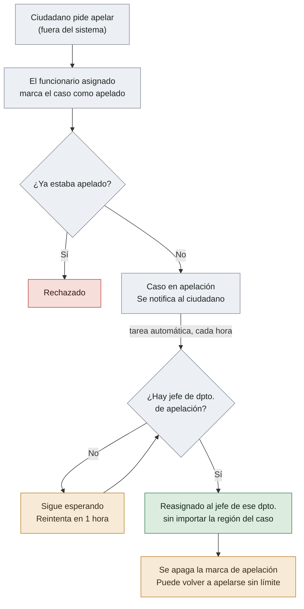
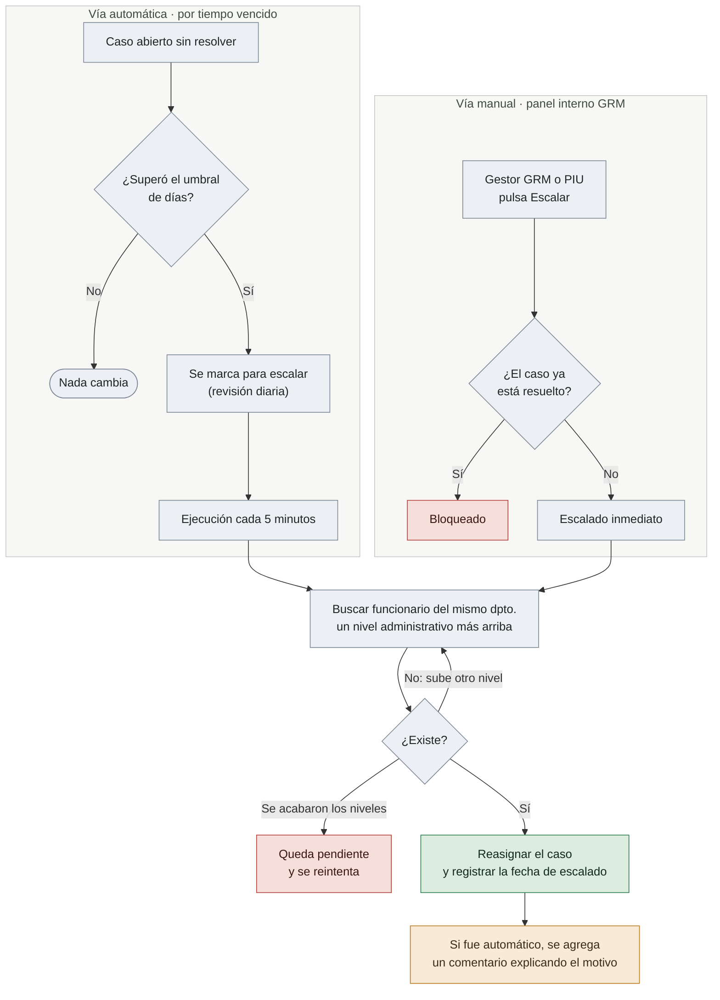

# Cómo funcionan hoy la Apelación y el Escalado de casos

Este documento describe el comportamiento **actual del código** (no el ideal ni el planeado) de dos mecanismos del GRM: la apelación de un caso y el escalado (manual y automático) entre niveles administrativos.

---

## 1. Sistema de Apelación

**¿Qué es?** Una bandera (sí/no) que marca un caso como "en apelación" y lo reasigna a un departamento fijo encargado de revisar apelaciones.

**¿Quién puede apelar un caso?**
Solo la persona actualmente **asignada** al caso (el gestor/funcionario que lo está manejando) puede activar la apelación, a través de la API de actualización de casos. **No existe un botón de apelación para el ciudadano**, ni en la app ni en el panel interno de GRM. En la práctica, si un ciudadano quiere apelar, debe pedírselo al funcionario asignado (por teléfono, en persona, etc.) para que este active la marca en el sistema.

**¿Cómo se activa?**
- La apelación solo puede pasar de "No" a "Sí" (no se puede desactivar manualmente, ni volver a apelar un caso que ya está marcado como apelado).
- No hay ninguna validación que exija que el caso esté "resuelto" o "cerrado" antes de apelar — técnicamente se puede marcar en cualquier estado del caso.
- Al activarse, se envía automáticamente una notificación al ciudadano (correo o SMS, según su método de contacto).

**¿Qué pasa después?**
Una tarea automática que corre **cada hora** revisa todos los casos marcados como "en apelación" y los reasigna al **jefe del departamento de apelación configurado para esa categoría de caso** (esto se configura una sola vez por categoría, durante el asistente/wizard de configuración). Importante:

- Esta reasignación **no sigue la jerarquía de niveles administrativos** (país → departamento → comuna). Salta directamente a un departamento fijo, sin importar en qué nivel territorial esté el caso.
- El lugar donde ocurrió el caso (su ubicación/región) **nunca cambia** — solo cambia la persona responsable de atenderlo.
- Una vez reasignado, la bandera de apelación se apaga automáticamente (vuelve a "No"), quedando el caso listo para que, si se quisiera, se vuelva a apelar en el futuro.
- Si la categoría del caso no tiene un jefe de departamento de apelación configurado, el caso simplemente se queda esperando y se reintenta cada hora.

**¿Cuántas veces se puede apelar un caso? ¿Hay un límite?**
**No existe ningún límite ni contador de apelaciones en el sistema actual.** No hay un campo que registre cuántas veces se ha apelado un caso, ni un tope máximo. La única regla es que no se puede apelar "de nuevo" mientras ya hay una apelación pendiente de procesar (porque la bandera solo puede pasar de No→Sí); pero como se resetea sola después de cada reasignación, en teoría un caso podría apelarse repetidamente sin restricción.

### 1.1 Diagrama del flujo de apelación

**Cómo leer el diagrama:** el único que puede iniciar el círculo es el funcionario asignado (no el ciudadano). Una vez activada la apelación, todo lo demás lo hace el sistema solo, en la siguiente pasada de la tarea horaria — y si no hay un jefe de apelación configurado para esa categoría, el caso queda dando vueltas en el mismo paso hasta que alguien lo configure.

---

## 2. Sistema de Escalado

**¿Qué es?** El proceso por el cual un caso se reasigna a un funcionario de un **nivel administrativo superior** (o inferior, si se "des-escala"), dentro del mismo departamento temático (por ejemplo, Salud, Educación), cuando no se está resolviendo a tiempo.

Existen dos formas de escalar: **automática** y **manual**. Ambas usan el mismo mecanismo de fondo (buscar al funcionario correspondiente subiendo o bajando por el árbol de regiones administrativas), pero se disparan de forma distinta.

### 2.1 Escalado automático

Funciona con dos procesos programados que corren en segundo plano:

1. **Marcado (una vez al día):** revisa todos los casos abiertos (que no estén en un estado final ni rechazado) y calcula cuántos días lleva cada caso en su estado actual. Si ese número supera el "umbral de días para escalar" configurado para ese estado (un valor configurable por estado, en el asistente de configuración), el caso se marca como "listo para escalar".

2. **Ejecución (cada 5 minutos):** toma todos los casos marcados como "listos para escalar" y busca un funcionario en el **nivel administrativo inmediatamente superior**, dentro del mismo departamento. Si lo encuentra, le reasigna el caso, registra la fecha de escalado y deja un comentario automático en el caso explicando que fue escalado por exceso de tiempo. Si no encuentra a nadie en ese nivel, sigue subiendo nivel por nivel hasta llegar a la raíz (nivel país); si aun así no encuentra a nadie, el caso queda pendiente y se reintenta en la siguiente corrida.

**Importante:** al igual que con la apelación, la ubicación original del caso nunca cambia — solo cambia quién es el responsable de atenderlo. Y **el ciudadano no recibe ninguna notificación cuando su caso es escalado**, ni de forma automática ni manual.

### 2.2 Escalado manual

Un gestor de GRM o personal autorizado (PIU) puede escalar o des-escalar un caso manualmente desde el panel interno, con un botón para cada acción:

- **Escalar:** busca al funcionario del nivel superior siguiente (mismo departamento) y reasigna el caso. Está bloqueado si el caso ya está en un estado final/resuelto.
- **Des-escalar:** hace lo contrario — busca un funcionario en el nivel inferior (dentro del árbol de regiones) y reasigna el caso hacia abajo.

**Nota:** el des-escalado **solo existe de forma manual**. No hay ningún proceso automático que baje un caso de nivel.

### 2.3 Diagrama del flujo de escalado

**Cómo leer el diagrama:** hay dos "entradas" al mismo mecanismo — el reloj (automático) o un clic humano (manual) — pero ambas terminan en el mismo paso: buscar, dentro del mismo departamento temático, al funcionario del nivel administrativo inmediatamente superior. La única diferencia visible después de reasignar es que el escalado automático deja un comentario explicando por qué ocurrió; el manual no. El des-escalado (bajar de nivel) sigue la misma lógica pero hacia abajo en el árbol, y solo existe en la vía manual.

### 2.4 Diferencia clave entre Apelación y Escalado

| | Apelación | Escalado |
|---|---|---|
| Quién lo activa | Solo el funcionario asignado al caso | Sistema automático (por tiempo) o un gestor/PIU manualmente |
| A dónde se reasigna | Un departamento fijo configurado por categoría de caso | El siguiente nivel administrativo (arriba o abajo), dentro del mismo departamento |
| ¿Sigue la jerarquía territorial? | No — salta directo a un punto fijo | Sí — sube o baja un nivel a la vez |
| ¿Hay límite? | No hay contador ni tope | No hay tope de "veces", pero se topa naturalmente con el nivel más alto (país) |
| ¿Notifica al ciudadano? | Sí, al activarse | No, en ningún caso |
| ¿Queda registro/historial? | Solo el último estado (sí/no) y el motivo en texto libre | Solo la fecha del último escalado y un comentario (si fue automático) |

---

## 3. Los niveles administrativos y cómo se mueve un caso entre ellos

Las regiones administrativas están organizadas como un árbol (por ejemplo, para Benín: **País → Departamentos → Comunas**), con un único nivel raíz (el país).

Cuando un caso "sube" o "baja" de nivel (por escalado), lo que realmente cambia es **quién es el funcionario responsable**, no la ubicación del caso. El sistema busca, dentro del mismo departamento temático (ej. Salud), al funcionario asignado al nivel administrativo padre (para subir) o a un nivel hijo (para bajar) de la región donde está actualmente el responsable del caso.

La ubicación real donde ocurrió el problema (la región del caso) se define una sola vez, al crear el caso, y **nunca se modifica** por apelación ni por escalado — es un dato histórico fijo del caso.

---

## 4. Puntos a tener en cuenta

- **La apelación depende del funcionario asignado, no del ciudadano.** Si se espera que el ciudadano pueda apelar directamente, esa función todavía no existe en el sistema.
- **No hay límite de apelaciones.** Si se necesita un tope (por ejemplo, "máximo 2 apelaciones por caso" o "solo se puede apelar hasta el nivel país"), hay que construirlo — hoy no existe.
- **Los procesos automáticos (escalado y reasignación de apelaciones) dependen de un proceso en segundo plano (Celery) que debe estar corriendo por separado del sitio web.** Si ese proceso no está activo en un entorno determinado, el escalado automático y la reasignación de apelaciones simplemente no ocurren, aunque el código exista.
- **No se notifica al ciudadano cuando su caso es escalado** (solo cuando se crea, cambia de estado, se asigna, o se apela).
